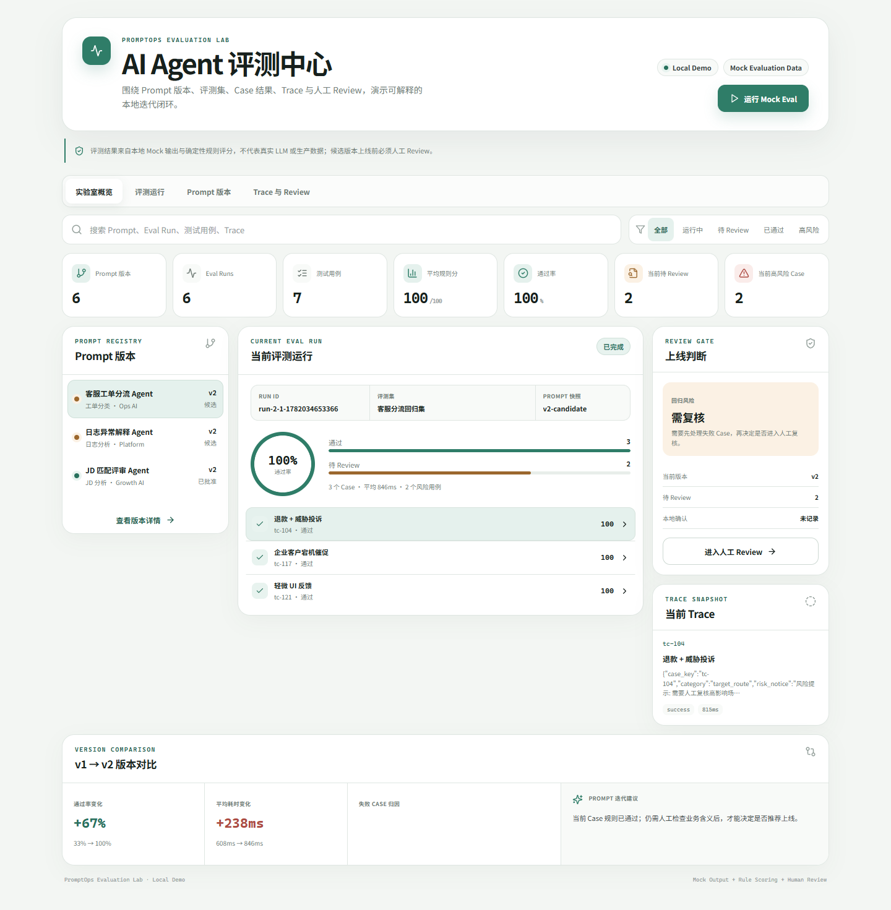
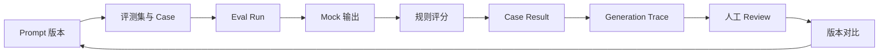
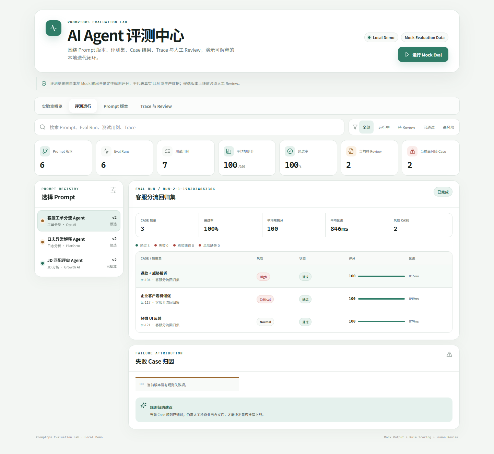
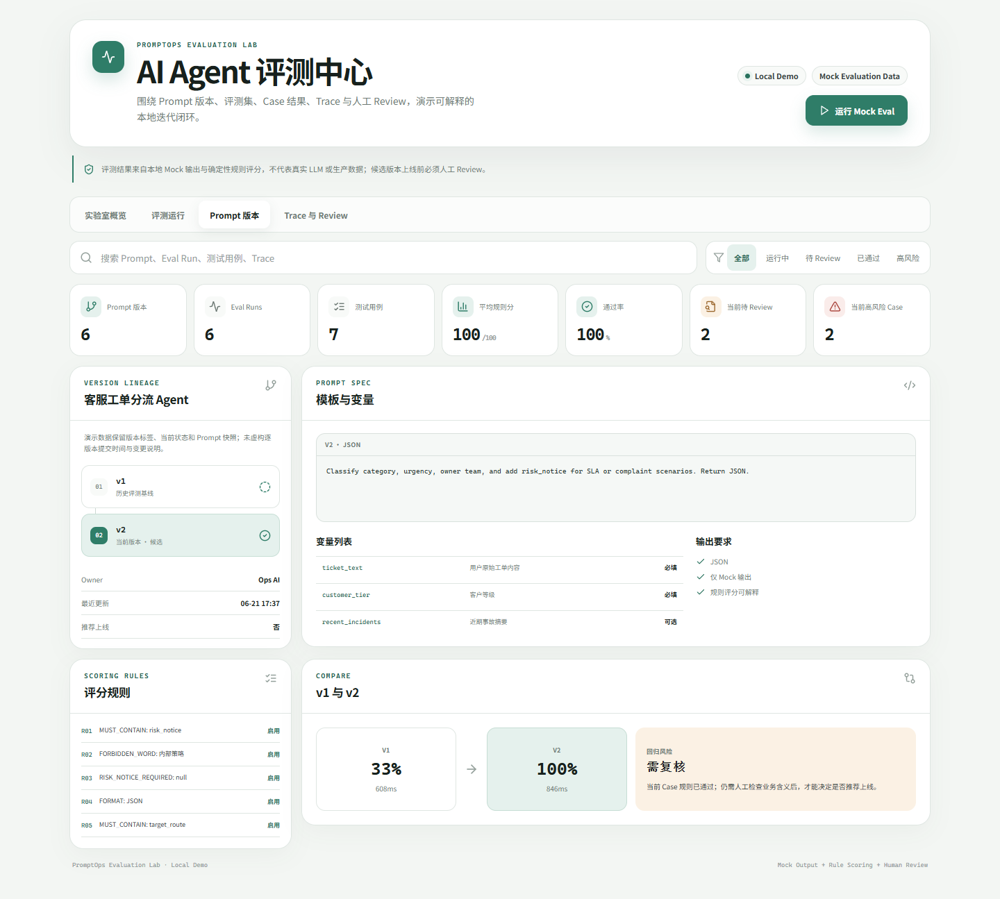
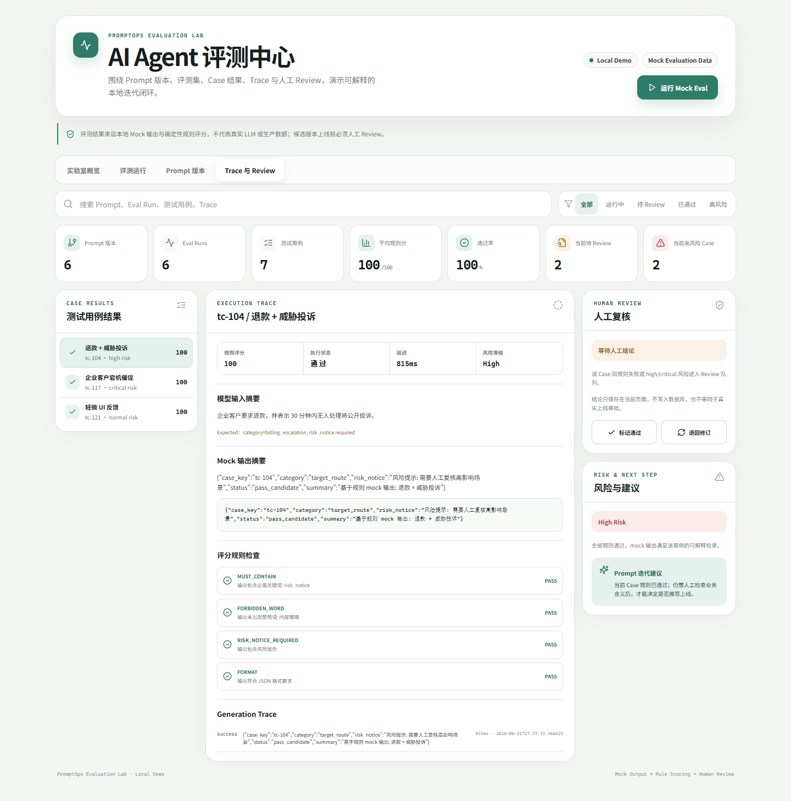

# PromptOps Evaluation Lab

PromptOps 本地实验台：规则评测引擎 + Prompt 版本管理 + Eval Run 落库闭环。这个个人作品集项目用一套可本地复现的工程闭环，演示如何管理 Prompt 版本、执行规则评测、定位失败 Case、查看 Trace、完成人工 Review，并据此提出下一轮 Prompt 迭代建议。

> [!IMPORTANT]
> 这是用于 GitHub、实习简历和面试演示的本地项目，不是生产系统。页面数据来自种子 Demo；输出由确定性 Mock 生成器产生，评分来自可解释规则。项目不包含真实用户数据，不包含真实 LLM 调用，页面中的人工 Review 结论也不持久化。

## 诚实边界

- 当前无真实 LLM 调用。
- 当前无真实 AI Agent。
- 当前无多模型对比。
- 当前无 LLM-as-Judge。
- MockOutputGenerator 基于确定性规则生成输出，用于验证评测流程。
- RuleEvaluator 基于规则评分，不是 AI 语义评分。
- Review 结论当前部分为前端演示状态，不是后端持久化审批流。



## 项目亮点

- 技术栈扎实：Spring Boot 3 + Java 17 + MyBatis-Plus，前端使用 Vue 3 + TypeScript 真实 fetch 后端 API。
- 数据建模完整：Prompt 模板 / 版本、Eval Dataset / Eval Case / Rule / Run / Result / Trace 均有领域对象和落库结构。
- 完整闭环：`Prompt Version → Eval Dataset → Eval Run → Case Result → Rule Scoring → Trace → Human Review → Version Compare`。
- 可解释评测：支持必含词、禁用词、风险提示与输出格式规则；JSON 使用确定性解析校验，Case 结果可回溯到逐条规则检查。
- 双运行模式：默认 MySQL 配置用于完整后端演示；`demo` profile 使用内存 H2，无需外部数据库即可复现页面与截图。
- 真实交互：Prompt 切换、Case 切换、搜索、状态筛选、Mock Eval 重跑、Trace 查询与本地 Review 状态均可操作；规则失败或 high/critical 风险 Case 会进入待 Review 队列。
- 可验证展示：Playwright 启动真实前后端，先验证关键交互、浏览器错误与 1366px / 390px 响应式，再生成 1440px / 1920px 两套截图，完成后确认独立端口释放。
- 诚实边界：页面与文档持续标注 Local Demo、Mock Evaluation Data、规则评分来源和人工审批边界。

## 核心流程



## 技术栈

| 层级 | 技术 | 用途 |
| --- | --- | --- |
| 前端 | Vue 3、TypeScript、Vite、Lucide | 实验室视图、交互状态、API 展示 |
| 后端 | Java 17、Spring Boot 3、MyBatis-Plus | PromptOps 领域服务与 REST API |
| 数据 | MySQL、H2 Demo Profile | 持久化结构与零配置本地演示 |
| 测试 | JUnit 5、Spring Boot Test | 验证规则、Review 策略、Run 汇总与版本对比 |
| 展示 | Playwright | 交互/响应式断言、真实浏览器截图与进程清理 |

## 功能与页面

| 评测运行 | Prompt 版本 |
| --- | --- |
|  |  |
| Case Result、状态筛选、评分与失败归因 | 版本链路、模板变量、评分规则与版本对比 |

| Trace 与 Review | 实验室概览 |
| --- | --- |
|  |  |
| 输入/输出摘要、逐条规则检查、Generation Trace、人工复核 | Prompt、Run、风险、Review 与迭代建议聚合 |

1920px 原图位于 [`docs/images/large`](docs/images/large)。所有截图均由当前仓库中的真实 Vue 页面生成；截图内容是本地 Demo/Mock 数据。

## 快速启动

环境要求：Java 17、Maven 3.9+、Node.js 18+。

### 1. 零配置 Demo 模式（推荐）

PowerShell 终端 1：

```powershell
$env:SPRING_PROFILES_ACTIVE="demo"
mvn -pl backend spring-boot:run
```

PowerShell 终端 2：

```powershell
cd frontend
npm install
npm run dev
```

打开 `http://localhost:5174`。Demo 后端使用内存 H2，启动时写入虚构评测集并执行确定性 Mock Eval；进程停止后数据清空。

### 2. MySQL 模式

先创建数据库：

```sql
CREATE DATABASE ai_agent_eval_promptops
  DEFAULT CHARACTER SET utf8mb4
  COLLATE utf8mb4_unicode_ci;
```

通过环境变量提供本地配置，不要把真实密码提交到仓库：

```powershell
$env:PROMPTOPS_DB_URL="jdbc:mysql://127.0.0.1:3306/ai_agent_eval_promptops?useUnicode=true&characterEncoding=utf8&serverTimezone=Asia/Shanghai&allowPublicKeyRetrieval=true&useSSL=false"
$env:PROMPTOPS_DB_USER="promptops_user"
$env:PROMPTOPS_DB_PASSWORD="<local-password>"
$env:PROMPTOPS_SQL_INIT="always"
$env:PROMPTOPS_DEMO_DATA="true"
mvn -pl backend spring-boot:run
```

配置示例见 [`backend/src/main/resources/application-example.yml`](backend/src/main/resources/application-example.yml)，数据库结构见 [`backend/src/main/resources/schema.sql`](backend/src/main/resources/schema.sql)。

## 测试与验收

```powershell
# 后端闭环测试
mvn -pl backend test

# 前端类型检查与生产构建
cd frontend
npm install
npm run typecheck
npm run build

# 验证交互与响应式，并生成 8 张真实浏览器截图
npm run screenshots
```

当前验收基线：9 个后端测试通过（2 个集成测试、7 个领域单元测试）；前端 TypeScript 检查与 Vite 构建通过；Playwright 交互/响应式断言通过并可重复生成 8 张截图。详细清单见 [`docs/acceptance-checklist.md`](docs/acceptance-checklist.md)。

## 项目结构

```text
.
├── backend/                 # Spring Boot + MyBatis-Plus + MySQL/H2
├── frontend/                # Vue 3 PromptOps Evaluation Lab
│   └── scripts/             # Playwright 截图脚本
├── docs/
│   ├── images/              # 1440px 截图
│   │   └── large/           # 1920px 截图
│   ├── architecture.md
│   ├── demo-script.md
│   ├── interview-guide.md
│   └── acceptance-checklist.md
└── pom.xml                  # Maven 聚合项目
```

## 项目边界

- 已实现：Prompt/版本/评测集/Case/规则/Run/Result/Trace 的后端闭环，规则评分、版本对比与本地 Demo 展示。
- 未实现：真实 LLM Provider、真实 AI Agent、多模型对比、LLM-as-Judge、RAG、向量数据库、异步队列、生产监控、多租户、权限系统和持久化审批。
- Demo 语义：种子数据、运行指标和截图仅用于展示 PromptOps 工作流，不代表真实线上评测平台或企业使用情况。
- Review 语义：后端领域策略只判断 Case 是否需要 Review（规则失败，或风险等级为 high/critical）；前端 Review 结论仅是页面内交互状态。真正上线决策仍需后端审批模型、审计日志和权限控制。

## 简历可写亮点

- 设计并实现 PromptOps 本地实验台：基于 Spring Boot 3 + MyBatis-Plus 建模 Prompt 模板、版本、评测集、评测结果与 Generation Trace；实现可解释规则评分引擎，支持 Eval Run 批量评测、结果落库、版本对比与 Vue 3 可视化展示。（当前阶段为规则层闭环，未接入真实 LLM。）
- 使用 Spring Boot + MyBatis-Plus 建模评测领域对象，并通过领域单元测试与 H2 集成测试验证评分、风险队列和核心工作流。
- 使用 Vue 3 + TypeScript 构建可搜索、可筛选、可交互的评测实验室，并明确区分 Mock 结果与生产数据。
- 编写 Playwright 自动验收与截图流程，在 Windows 下验证关键交互、响应式和端口释放，生成可用于 GitHub/简历的展示资产。

## 面试可讲点

- 为什么规则评测适合作为第一阶段，而不是直接接 LLM-as-Judge。
- 如何把 Prompt 版本、Dataset、Run、Case Result 和 Trace 设计成可追溯的数据模型。
- Mock Eval 的价值与局限，以及如何避免把演示指标包装成生产结论。
- 如何从 Case 失败原因归纳 Prompt 迭代建议，并用同一评测集控制回归风险。
- 从本地 Demo 扩展到真实模型时，需要补哪些队列、幂等、成本、审计和权限能力。

更多讲解提纲见 [`docs/interview-guide.md`](docs/interview-guide.md)，3 分钟演示路径见 [`docs/demo-script.md`](docs/demo-script.md)。

## 后续可扩展方向

1. 抽象 LLM Provider 接口并加入调用预算、超时、重试与脱敏日志。
2. 增加 LLM-as-Judge，同时保留确定性规则作为可解释基线。
3. 将 Eval Run 改为异步任务，补充幂等键、队列状态和失败重放。
4. 为 Prompt Review 增加持久化审批、角色权限和审计记录。
5. 增加数据集版本、基线锁定、置信区间与跨版本回归报告。
