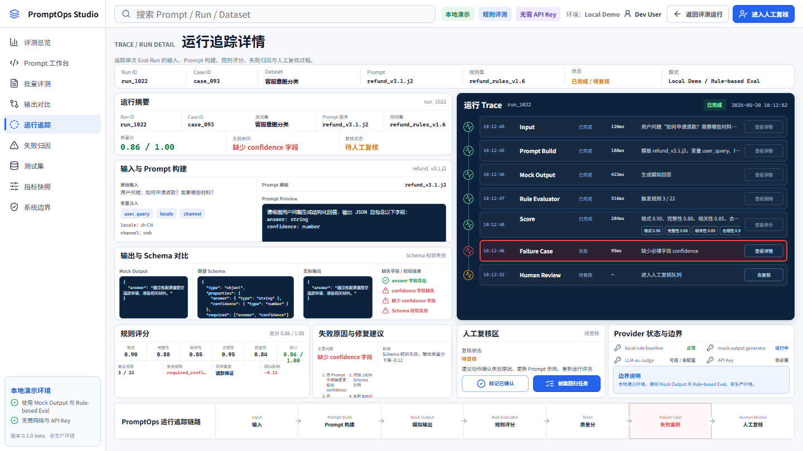
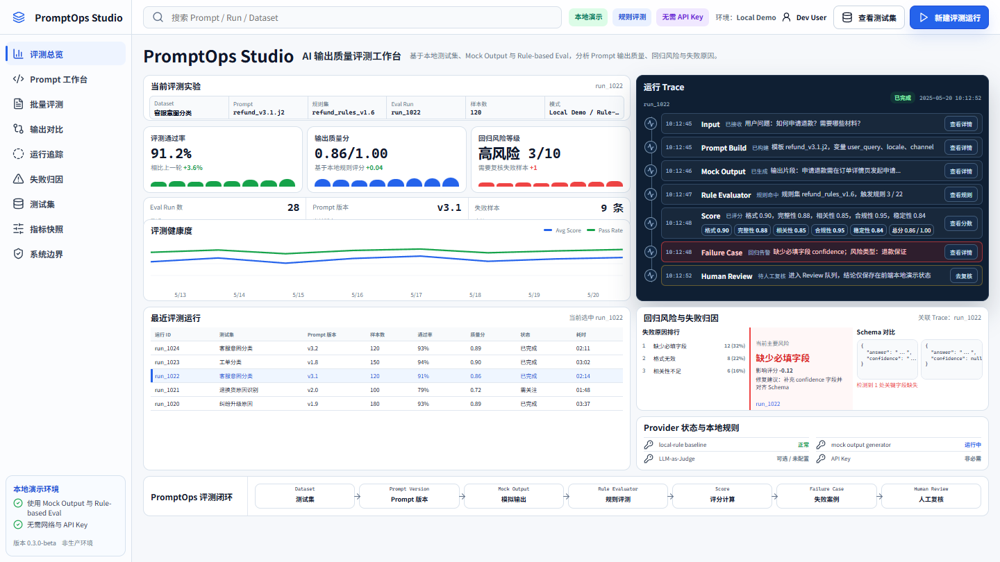
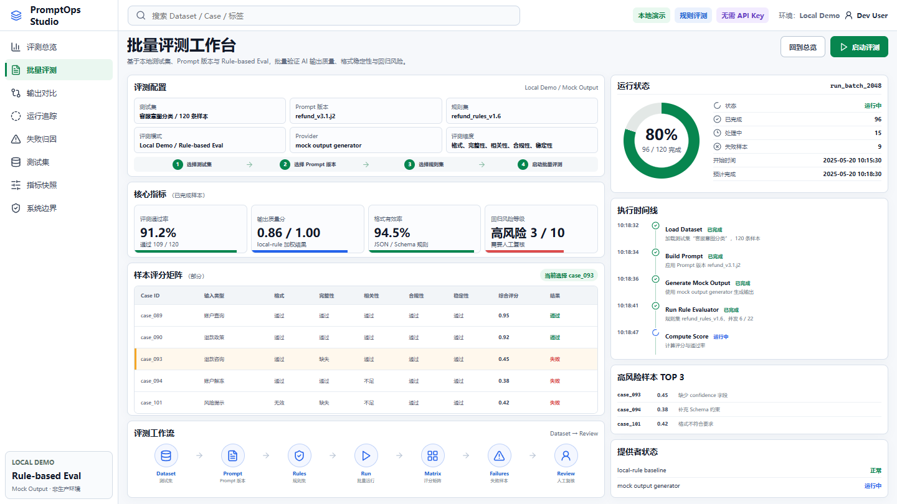
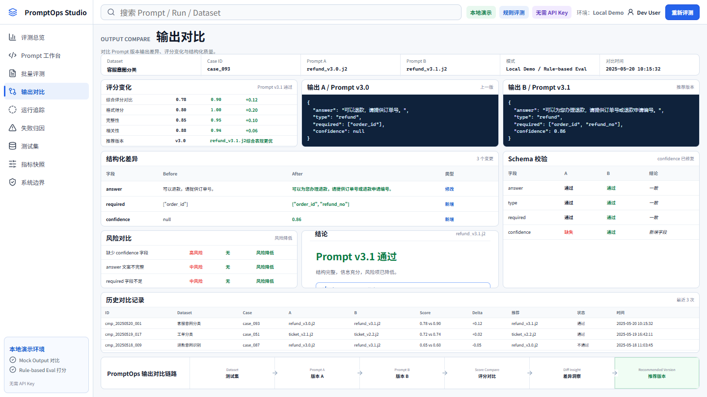
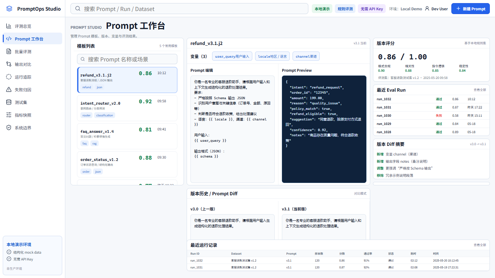
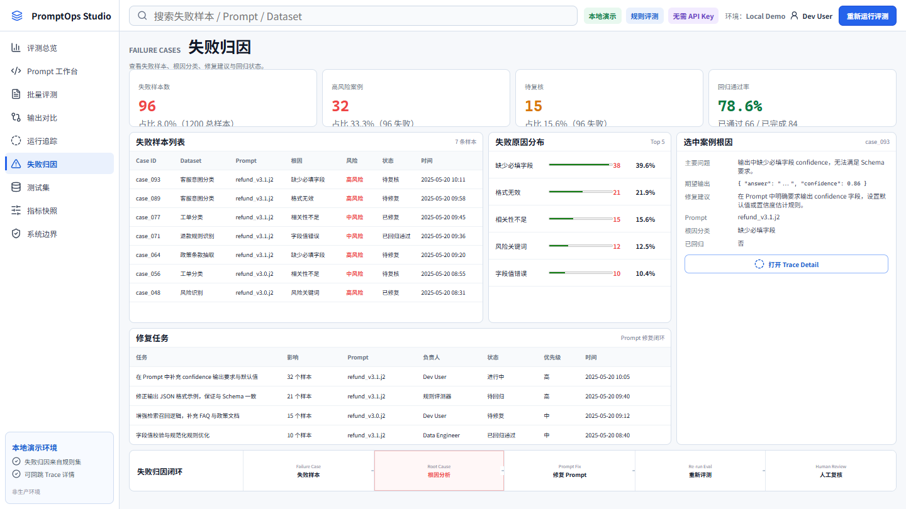
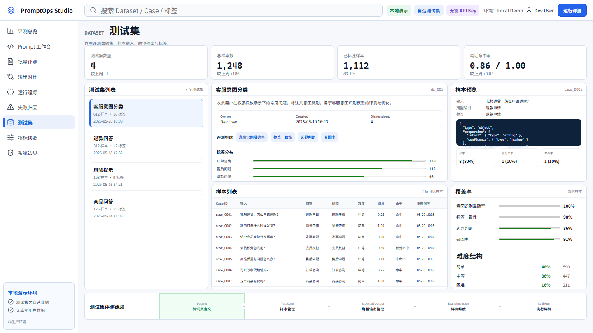
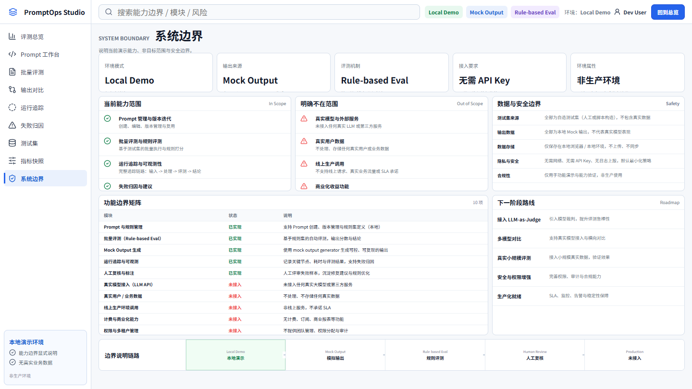
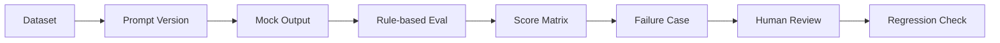

# PromptOps Studio

**AI Agent Eval / Prompt Regression Console**

一个本地可运行的 Prompt 评测与回归分析控制台，用于展示 Prompt 版本、批量评测、输出对比、Trace 追踪、失败归因与人工复核闭环。


> [!IMPORTANT]
> 当前版本是 **Local Demo**：使用确定性 **Mock Output** 与 **Rule-based Eval**，无需 API Key，不包含真实用户数据。项目未接入真实模型，LLM-as-Judge 未启用，人工复核结论也不是生产审批记录。

## Showcase



运行追踪详情展示从输入、Prompt 构建、Mock Output、规则评测、失败样本到人工复核的完整链路。

## 功能截图

### Eval Dashboard / 评测总览



聚合当前评测实验、核心指标、风险样本、运行 Trace 与 Prompt 迭代建议。

### Batch Evaluation / 批量评测



配置 Dataset、Prompt Version 与规则集，并查看运行进度、Score Matrix 和评测工作流。

### Output Compare / 输出对比



对比 Prompt 版本输出、规则得分、Schema 差异与回归风险。

### Prompt Studio / Prompt 工作台



管理 Prompt 模板、版本链路、变量、规则配置与本地调试上下文。

### Failure Cases / 失败归因



按根因聚合失败样本，关联修复任务、回归状态与人工复核节点。

### Dataset / 测试集



管理 Eval Dataset、Test Cases、期望输出、标签分布、覆盖率与难度结构。

### System Boundary / 系统边界



集中说明 Local Demo、Mock Output、Rule Evaluator、数据来源与当前未实现能力。

## Core Features

- **Prompt 版本管理**：维护模板、变量、版本链路与评测规则。
- **Batch Evaluation 批量评测**：组合 Dataset 与 Prompt Version，查看 Run 状态和 Score Matrix。
- **Output Compare 输出对比**：比较版本输出、规则分、Schema 与回归差异。
- **Trace / Run Detail 运行追踪**：追溯输入、Prompt 构建、Mock Output、规则检查与失败原因。
- **Failure Cases 失败归因**：聚合根因、风险样本、修复建议与回归任务。
- **Dataset / Test Cases 测试集管理**：组织样本、期望输出、标签、覆盖率与难度。
- **Human Review 人工复核**：展示从失败样本到复核结论的本地闭环，结论不持久化。
- **System Boundary 能力边界**：明确演示数据、评测方式和未接入能力。

## Workflow



## Tech Stack

| 层级 | 技术 | 当前用途 |
| --- | --- | --- |
| Frontend | Vue 3 / TypeScript / Vite / Lucide | 多页面 PromptOps 控制台与本地交互 |
| Backend | Java 17 / Spring Boot 3.3 / MyBatis-Plus | Prompt、Dataset、Eval Run、Case Result 与 Trace API |
| Data | MySQL / H2 Demo Profile | 持久化结构与零配置本地演示 |
| Build & Check | npm scripts / vue-tsc / Playwright | 构建检查、16:9 首屏断言与本地截图 |
| Demo Mode | Local Demo / Mock Output / Rule-based Eval | 无需 API Key 的可复现演示 |

## Local Run

环境要求：Java 17、Maven 3.9+、Node.js 18+。

### 1. 启动 Demo 后端

在项目根目录执行：

```powershell
$env:SPRING_PROFILES_ACTIVE="demo"
mvn -pl backend spring-boot:run
```

Demo profile 使用内存 H2 与虚构种子数据，服务地址为 `http://localhost:18080`。接口文档位于 `http://localhost:18080/swagger-ui.html`。

### 2. 启动前端

打开另一个终端：

```powershell
cd frontend
npm install
npm run dev
```

访问 `http://localhost:5174`。前端 `/api` 请求默认代理到本地 `18080` 端口。

## Verification

以下命令均存在于 [`frontend/package.json`](frontend/package.json)，并已用于当前展示版验收：

```powershell
cd frontend
npm run build
npm run check:dashboard:16x9
npm run check:batch:16x9
npm run check:trace:16x9
npm run check:showcase-pages
```

Playwright 检查使用本地 Vite 页面生成 `1440x810`、`fullPage: false` 的正式展示截图，并验证关键区域位于首屏内。

## Project Boundary

- 当前版本是本地演示环境，标记为 **Local Demo / 非生产环境**。
- 输出来自确定性 `MockOutputGenerator`，不是模型生成结果。
- 评分来自 `RuleEvaluator`，属于 **Rule-based Eval**，不是 AI 语义裁判。
- 无需 API Key，未接入真实模型或真实 Provider。
- 未使用真实用户数据，页面内容为虚构 Demo 数据。
- LLM-as-Judge 未启用或接入，多模型对比、RAG、异步队列与生产监控也未实现。
- Human Review 当前主要用于页面闭环演示，不代表持久化审批、权限或审计系统。

## Resume Pitch

面向 AI 应用开发场景，设计并实现 PromptOps Studio，用于管理 Prompt 版本、批量评测输出质量、追踪单次运行链路、定位失败样本并形成回归复核闭环。项目采用 Vue 3 / TypeScript 构建多页面控制台，通过 Mock Output 与 Rule-based Eval 在本地完成可复现演示，并使用 Playwright 生成 16:9 展示截图用于作品集说明。

## 面试可讲

- 为什么先以确定性规则建立可解释、可复现的评测基线。
- 如何组织 Prompt Version、Dataset、Eval Run、Case Result 与 Generation Trace。
- 如何从 Failure Case 进入 Human Review，再用同一 Dataset 做 Regression Check。
- 接入真实模型前还需要补充哪些 Provider、预算、重试、脱敏、审计与权限能力。

更多工程说明见 [`docs/architecture.md`](docs/architecture.md)，演示路径见 [`docs/demo-script.md`](docs/demo-script.md)，验收边界见 [`docs/acceptance-checklist.md`](docs/acceptance-checklist.md)。
