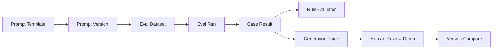
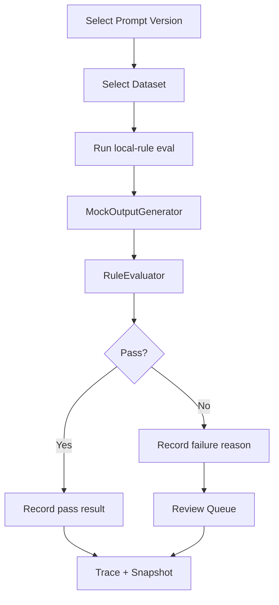

# README 升级规划

本文件规划 README 后续升级，不在本轮直接修改 `README.md`。

## 1. README 一句话定位

推荐：

> PromptOps Studio 是一个本地可复现的 AI Prompt 评测控制台，围绕 Prompt 版本管理、批量规则评测、失败案例回放、Generation Trace 和人工 Review 演示，展示 PromptOps 工程闭环。

边界补充：

> 当前阶段使用确定性 Mock 输出和 local-rule baseline，不接真实 LLM，不包含真实 Agent Runtime。

## 2. README 首屏结构

建议首屏顺序：

1. 项目名：PromptOps Studio / PromptOps Evaluation Lab。
2. 一句话定位。
3. 静态技术徽章。
4. 诚实边界提示。
5. 一张核心 Dashboard 截图。
6. 三个核心亮点：Prompt Versioning、Batch Eval、Trace / Failure Review。

## 3. 截图展示顺序

推荐：

1. Eval Dashboard：总览。
2. Batch Evaluation：批量评测流程。
3. Trace / Run Detail：可追溯执行链。
4. Prompt Studio / Prompt Compare：版本和 Diff。
5. Failure Cases：失败样本归因。
6. Dataset Lab：测试集资产。

当前已有截图可先保持：

- `docs/images/dashboard.png`
- `docs/images/eval-run.png`
- `docs/images/prompt-versions.png`
- `docs/images/trace-review.png`

未来只有在真实运行截图脚本后，才能替换或新增 README 截图。

## 4. 核心能力模块

README 建议拆为：

- Prompt 管理：Template、Version、variables_json、output format。
- Eval 运行：Dataset、Case、Rule、Run、Result。
- 可解释评分：RuleEvaluator 和逐条规则结果。
- Trace：Input/Output summary、status、failure reason、simulated latency。
- Review：本地前端 Review 状态和后续持久化规划。
- Version Compare：同 Dataset 下 v1/v2 对比。

## 5. 技术栈模块

建议保留表格：

| 层 | 技术 | 项目中用途 |
| --- | --- | --- |
| Frontend | Vue 3、TypeScript、Vite | PromptOps 控制台 |
| Backend | Java 17、Spring Boot 3、MyBatis-Plus | REST API 与领域服务 |
| Data | MySQL、H2 | 持久化与本地 Demo |
| Eval | RuleEvaluator、MockOutputGenerator | local-rule baseline 与 Mock 输出 |
| Docs | Springdoc OpenAPI、Markdown | API 文档与作品集展示 |
| Test | JUnit 5、Playwright | 后端测试与截图验收 |

## 6. PromptOps 工作流图

建议 README 保留 Mermaid：



## 7. Evaluation 流程图



## 8. 数据指标快照

README 中可新增“当前本地快照”，但必须来自 `docs/metrics/eval_snapshot.md`。

字段建议：

- Prompt Templates
- Prompt Versions
- Eval Datasets
- Test Cases
- Eval Runs
- Rule Types
- Pass Rate
- Avg Score
- Failure Cases
- Tests Passing

未采集前不要写具体数字。

## 9. Baseline 对比表

建议表格：

| Baseline | Candidate | Dataset | Pass Rate | Avg Score | Failure Cases | 结论 |
| --- | --- | --- | --- | --- | --- | --- |
| Prompt v1 | Prompt v2 | 同一评测集 | 待采集 | 待采集 | 待采集 | local-rule 结论 |

要求：

- 数据来自 `docs/metrics/baseline_compare.md`。
- 结论写“基于本地规则”，不写真实模型效果。

## 10. 本地启动方式

README 当前已有，可保持：

- Demo profile：`SPRING_PROFILES_ACTIVE=demo` + `mvn -pl backend spring-boot:run`
- Frontend：`cd frontend && npm install && npm run dev`
- Swagger UI：`http://localhost:18080/swagger-ui.html`

建议补充：

- Demo 数据进程停止后清空。
- 本地页面默认不需要 API Key。
- MySQL 密码通过环境变量传入。

## 11. 评测命令

建议保留：

```powershell
mvn -pl backend test
cd frontend
npm run typecheck
npm run build
npm run screenshots
```

说明：

- `npm run screenshots` 会启动本地服务并覆盖 `docs/images`，需要用户确认后再运行。
- 不要把 `dist/`、`target/`、`node_modules/` 提交。

## 12. 项目亮点

README 可强调：

- 不是简单 Prompt demo，而是评测闭环。
- 后端领域模型完整。
- 前端真实消费 API。
- 规则评分可解释。
- Trace 和 Failure Case 支持定位问题。
- 文档明确边界，不夸大真实 AI 能力。

## 13. 简历写法

README 可以放“简历表达建议”，但要简短：

> 基于 Spring Boot 3 + Vue 3 搭建 PromptOps 本地评测控制台，围绕 Prompt 模板、版本、评测集、规则评分、Trace 和 Review 演示实现可复现评测闭环；当前使用 MockOutputGenerator 与 local-rule baseline，未接真实 LLM。

## 14. 面试可讲点

- 为什么第一阶段选择 local-rule baseline。
- Prompt Version、Dataset、Run、Case Result、Trace 如何建模。
- 如何保证 v1/v2 对比公平。
- 为什么 Mock 输出仍然要落库和生成 Trace。
- 后续如何接真实 Provider、LLM-as-Judge、token/cost、Review 审计。

## 15. 边界说明

README 必须持续明确：

- 无真实 LLM。
- 无真实 Agent Runtime。
- 无真实线上用户。
- 无生产部署。
- 无 LLM-as-Judge。
- 无多模型对比。
- Review 未完整持久化。
- latency 是模拟值。

## 16. 不允许写进 README 的内容

- 真实线上用户。
- 真实商业收益。
- 未验证性能提升。
- 未接入却声称接入真实模型。
- 没有来源的数据。
- 把 mock 数据写成生产数据。
- 把小样本测试写成大规模线上验证。
- “生产级”“商用级”“线上稳定运行”等夸大表述。

## 17. README 最终验收标准

- README 首屏 10 秒内能看出：这是 AI Eval / PromptOps 项目。
- 截图来自真实本地页面。
- 指标都能追溯到 `docs/metrics` 或命令输出。
- 项目亮点和边界同时清晰。
- 启动命令可复现。
- 不出现未实现能力。
- 不需要真实 API Key 也能演示 Demo。
